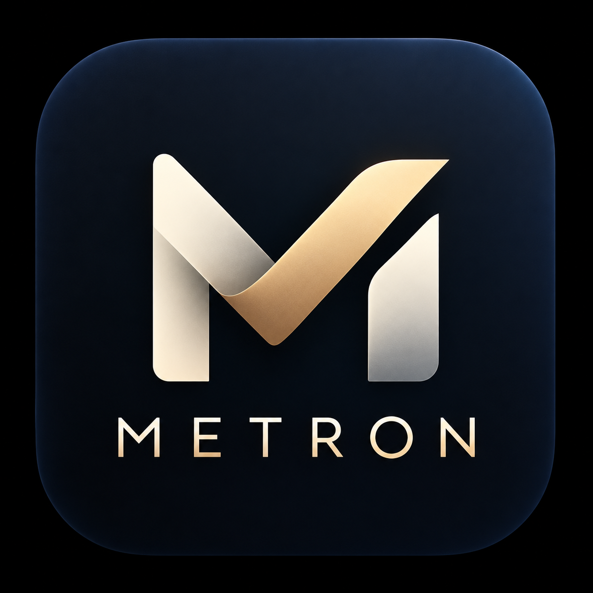

# 🏛️ Metron (Μέτρον) — God-Tier Offline Native Android Expense Tracker

> **“Μέτρον ἄριστον” (Métron áriston)** — *“Measure in all things.”*  
> — Cleobulus of Lindos

<p align="center">
  
</p>

<p align="center">
  <b>A tranquil, world-class personal finance sanctuary for Android.</b><br>
  Built with Hellenic harmony, zero internet permissions, and effortless zero-friction expense recording.
</p>

---

## ✨ Design Philosophy

Metron is not merely an expense tracker. It is a mindful personal money companion built around the ancient Greek principle of **Métron** — proportion, moderation, and clarity.

- **Zero Friction:** "I just spent money. Record it in seconds."
- **Total Privacy:** **100% Offline**. `android.permission.INTERNET` is **NOT** present in the manifest. Zero trackers, zero ads, zero cloud dependencies. Your data never leaves your physical device.
- **Financial Calm:** An interface designed to eliminate financial anxiety through peaceful typography, golden accents, and clear daily allowances.

---

## 🏛️ Key Features

### 1. ⚡ Zero-Friction Quick Add
- Tactile number pad with instant response and fast bump chips (`+50`, `+100`, `+500`, `+1000`).
- **Merchant Memory:** Typing or selecting a recent merchant intelligently auto-selects the category and payment account based on your history.
- Seamless toggling between **Expense**, **Income**, and **Account Transfers**.

### 2. 🏛️ The Sanctuary (Home Overview)
- **Hero Spending Card:** View spending by *Today*, *This Week*, *This Month*, or *All Time*.
- **Daily Spending Allowance:** Dynamically calculates how much you have left to spend each day to stay within your monthly measure.
- **Today's Timeline:** Instant overview of today's purchases with quick repeat and delete-with-undo.
- **Actionable Insights:** Practical, human observations about your spending habits.

### 3. 📜 The Ledger (Full Transaction History)
- Universal real-time search across merchants, notes, categories, tags, and amounts.
- Multi-criteria filtering by Type (*Expense*, *Income*, *Transfer*), Category, and Account.
- Chronologically grouped by date with daily totals.
- Undo snackbar protection on deletions.

### 4. 🔮 The Oracle (Analytics & Spending Story)
- **Interactive Donut Chart:** Visualizes category distribution with percentage badges and color coding.
- **The Spending Story:** Transforms raw financial data into an articulate Greek-inspired narrative.
- **Cashflow Breakdown:** Inflow vs Outflow analysis with net savings calculation.
- **Merchant Leaderboard:** Tracks your most frequented merchants.

### 5. ⚖️ The Pillars & Cycles (Budgets & Recurring)
- **Monthly Measure Pillar:** Visual progress indicator with calm warning states.
- **Category Budgets:** Set specific allocations for Food, Dining, Shopping, etc.
- **Kronos Recurring Cycles:** Track scheduled bills, memberships, and subscriptions with upcoming due date tags and 1-tap "Pay" recording.

### 6. 🛡️ The Treasury & Vault (Accounts & Privacy)
- **Net Liquid Wealth:** Unified balance across Cash, Bank, UPI, Credit Cards, and Savings accounts.
- **Multi-Currency:** Support for INR (`₹`), USD (`$`), EUR (`€`), GBP (`£`), JPY (`¥`), AED (`AED`), SGD (`S$`), AUD (`A$`).
- **Hellenic Themes:**
  - *Aegean Dark* (Nocturnal obsidian with Olympian gold borders)
  - *Athenian Light* (Crisp marble with warm bronze highlights)
  - *OLED Pure Black* (Ultra high-contrast deep black)
- **Financial Calm Mode:** Simplifies numbers into minimalist serenity.
- **Data Sovereignty:** One-tap export to structured JSON and CSV for spreadsheets, with instant full JSON restore.
- **Demo Data Generator:** Pre-populates 30+ realistic transactions for instant evaluation.

### 7. 📱 Home Screen Widget
- Compact Android AppWidget displaying today's spent, monthly remaining balance, and a 1-tap shortcut to add expenses.

---

## 🛠️ Technology Stack & Architecture

- **Language:** Kotlin 2.3+
- **UI Framework:** Jetpack Compose with Material 3
- **Design System:** Custom Greek typography scale, Olympian Gold & Aegean Obsidian color palette
- **Storage:** Local SQLite via Android `SQLiteOpenHelper` with reactive Kotlin `StateFlow`
- **Minimum SDK:** Android 8.0 (API level 26)
- **Target SDK:** Android 15 / 16 (API level 36)
- **Permissions:** **ZERO Network Permissions**

---

## 📦 Download & Build

### Pre-built APK
The ready-to-install signed release APK is located at:
- `release/Metron-v1.0.0.apk`
- `Metron.apk`

### Building from Source

```bash
# Clone the repository
git clone https://github.com/CodeSorcerer-007/Metron.git
cd Metron

# Build the release APK
./gradlew assembleRelease

# The generated APK will be at:
# app/build/outputs/apk/release/app-release.apk
```

---

## 📜 License
Licensed under the Apache License 2.0. Crafted with passion for mindful personal finance.
